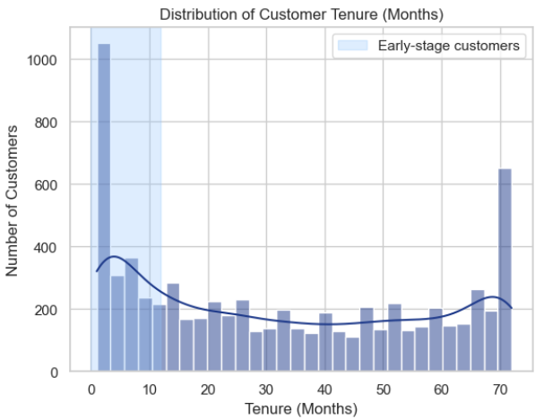

# 📊 Telecom Customer Churn Analysis (EDA)

## 📌 Project Overview

Customer churn is a critical problem in the telecom industry, directly affecting revenue and customer lifetime value.

This project performs **Exploratory Data Analysis (EDA)** on a telecom dataset to identify key factors driving churn and provide actionable insights to improve customer retention.

---

## 🎯 Objectives

- Analyze customer behavior and churn patterns  
- Identify key factors influencing churn  
- Segment high-risk customers  
- Provide data-driven recommendations for retention strategies  

---

## 🛠️ Tools & Technologies

- **Python**
- **Pandas & NumPy** – Data analysis and manipulation  
- **Matplotlib & Seaborn** – Data visualization  
- **Jupyter Notebook** – Analysis workflow  

---

## 📂 Dataset

- Source: Kaggle – Telco Customer Churn Dataset  
- Records: ~7,000 customers  
- Features: Demographics, services, billing, and churn  

---

## 📊 Sample Visualization



---

## 🔍 Key Analysis Performed

- Data Cleaning & Preprocessing  
- Handling missing values and data type corrections  
- Univariate Analysis (distributions, counts)  
- Bivariate Analysis (feature vs churn)  
- Correlation analysis  
- Customer segmentation  

---

## 🔑 Key Insights

- Customers on **month-to-month contracts** have the highest churn rates due to low commitment  
- **New customers (low tenure)** are significantly more likely to churn  
- **Higher monthly charges** are associated with increased churn risk  
- **Fiber optic users** exhibit higher churn compared to other service types  
- Customers using **electronic check payment methods** show higher churn, while auto-payment users have better retention  

👉 **High-risk customer profile:**  
Customers with low tenure, high monthly charges, month-to-month contracts, and manual payment methods are most likely to churn.

---

## 💡 Business Recommendations

- Encourage long-term contracts through incentives and discounts  
- Improve onboarding and engagement in the **first 6–12 months**  
- Reevaluate pricing for high-cost plans to improve perceived value  
- Investigate and enhance fiber optic service quality and experience  
- Promote automatic payment methods to reduce churn  

---

## 📁 Project Structure

```

telecom-customer-churn-eda/
│
├── churn_analysis.ipynb
├── data/
│ └── WA_Fn-UseC_-Telco-Customer-Churn.csv
├── images/
│ └── churn_distribution.png
├── README.md
└── .gitignore

```

---

## 🚀 How to Run

1. Clone the repository  
```bash
git clone https://github.com/Darshita-dp/telecom-customer-churn-eda.git

```
2. Navigate to the project
cd telecom-customer-churn-eda

3. Open Jupyter Notebook
jupyter notebook

## 📈 Future Improvements

Build a churn prediction model using Machine Learning
Create an interactive dashboard (Power BI / Streamlit)
Perform deeper customer segmentation

## 💬 Conclusion

This analysis shows that churn is primarily driven by low customer commitment, early lifecycle disengagement, pricing sensitivity, and service expectations.

Addressing these factors can significantly improve customer retention and long-term business performance.