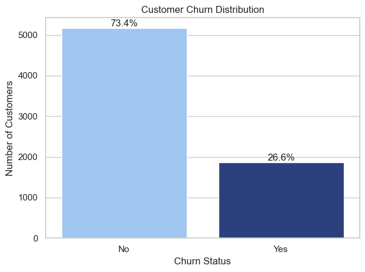
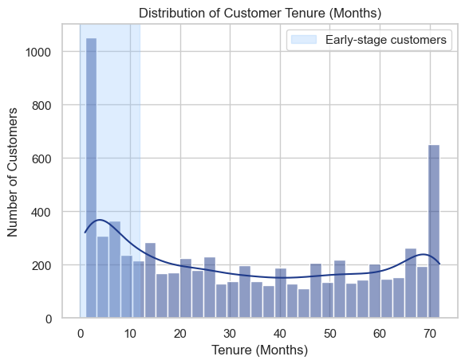
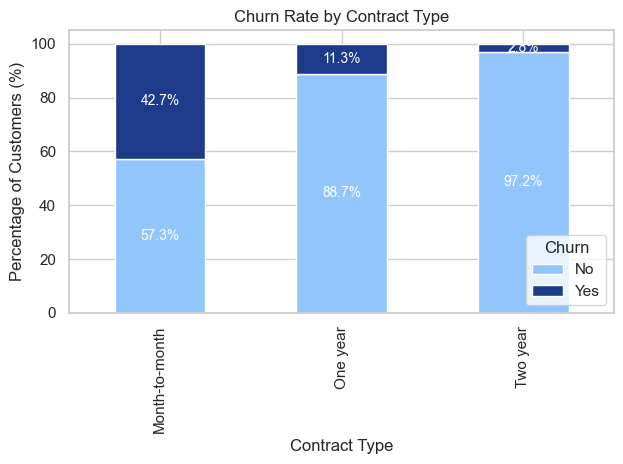

# 📊 Telecom Customer Churn Analysis (EDA) & Prediction System

## 📌 Project Overview

Customer churn is a critical problem in the telecom industry, directly impacting revenue and customer lifetime value.

This project builds an **end-to-end churn analysis and prediction system** that:
- Identifies key churn drivers
- Segments high-risk customers
- Predicts churn using machine learning
- Provides actionable business recommendations

---

## 🎯 Problem Statement

The goal is to analyze customer behavior and answer:

👉 **Which customers are likely to churn, and what should the business do to retain them?**

---

## 🛠️ Tools & Technologies

- **Python**
- **Pandas & NumPy** – Data analysis and manipulation  
- **Matplotlib & Seaborn** – Data visualization 
- **Scikit-learn** – Machine Learning (Logistic Regression) 
- **Jupyter Notebook** – Analysis workflow  

---

## 📂 Dataset

- Source: Kaggle – Telco Customer Churn Dataset  
- Records: ~7,000 customers  
- Features: Demographics, services, billing, and churn  

---

## 📊 Sample Visualizations


### Churn Risk Score


### Churn by Tenure


### Churn Contract


### Churn Correlation Heatmap


---

## 🔍 Project Workflow

1. Data Cleaning & Preprocessing  
2. Exploratory Data Analysis (EDA)  
3. Feature Engineering (customer segmentation)  
4. Churn Risk Scoring  
5. Machine Learning Model (Logistic Regression)  
6. Business Insights & Recommendations  

---

## 🔑 Key Insights

- Customers with **low tenure (< 12 months)** have the highest churn risk  
- **Month-to-month contracts** significantly increase churn  
- **Higher monthly charges** are associated with increased churn  
- Customers using **electronic check payments** show higher churn  
- High-risk customers are **~20x more likely to churn** compared to low-risk 

---

## 🤖 Churn Prediction Model

A Logistic Regression model was trained to predict churn.

### 📈 Model Performance

- Accuracy: **~78.7%**
- Precision (Churn): **0.62**
- Recall (Churn): **0.51**
- F1 Score: **0.56**

=> The model is effective overall but has moderate recall, indicating room for improvement in detecting all churn cases.

---

## 🎯 Churn Risk Scoring

A rule-based churn scoring system was created using:

- Low tenure (< 12 months)
- High monthly charges (> 70)
- Month-to-month contract

=> Customers with a score of **3 show ~69% churn**, compared to **~3% for low-risk customers**

---

## 🔍 Key Drivers of Churn

### 🔺 Increase Churn Risk
- Fiber optic internet service  
- Electronic check payment method  
- Higher monthly charges  

### 🔻 Reduce Churn Risk
- Longer tenure  
- One-year and two-year contracts  

---

## 💼 Business Recommendations

### 1. Early Lifecycle Retention
- Focus on customers within the first 12 months  
- Improve onboarding and engagement  

### 2. Contract Conversion Strategy
- Incentivize customers to switch to long-term plans  

### 3. High-Risk Customer Targeting
- Use churn scoring to prioritize retention efforts  

### 4. Pricing Optimization
- Improve value perception for high-cost plans  

### 5. Payment Method Optimization
- Promote automatic payment methods  

---

## 📁 Project Structure

```

telecom-customer-churn-eda/
│
├── telecom_churn_analysis.ipynb
├── data/
│ └── Telco-Customer-Churn.csv
├── data/
│ └── Telco-Customer-Churn.csv
│
├── notebooks/
│ └── telecom_churn_analysis.ipynb
│
├── src/
│ ├── preprocessing.py
│ ├── feature_engineering.py
│ └── model.py
│
├── outputs/
│ ├── plots/
| | ├── churn_by_tenure.png
│ | └── churn_score.png
│ | └── churn_by_charges.png
│ | └── churn_by_contract.png
│ | └── heatmap.png
| |
│ └── model_results/
|   ├── feature_importance.csv
│   └── model_metrics.csv
│
├── images/
|   ├── churn_by_tenure.png
│   └── churn_score.png
│   └── churn_by_contract.png
│   └── heatmap.png
│
├── requirements.txt
└── README.md

```

---

## 🚀 How to Run

1. Clone the repository  
```bash
git clone https://github.com/Darshita-dp/telecom-customer-churn-eda.git

```
```
2. Navigate to the project: 
   cd telecom-customer-churn-eda
   pip install -r requirements.txt
```
```
3. Open Notebook:
   Jupyter Notebook
```   
---

## 📈 Future Improvements

Improve model performance using Random Forest / XGBoost
Increase recall for churn prediction
Build interactive dashboard (Power BI / Streamlit)
Deploy model as a web application

---

## 💬 Conclusion

This project demonstrates how data analysis and machine learning can be combined to:

Identify churn drivers
Predict high-risk customers
Support data-driven retention strategies

=> The system can help businesses proactively reduce churn and improve long-term customer value.

---